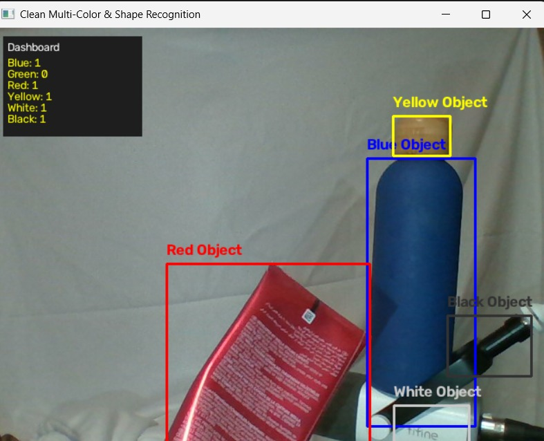

# Smart Object & Multi-Color Recognition System

## 📌 Project Overview
This project is an advanced computer vision application built with **Python** and **OpenCV**. It goes beyond basic color detection by integrating **Multi-Color Recognition** (including White and Black), **Geometric Shape Classification** (Square, Rectangle, Triangle), a **Real-time Smart Inventory Dashboard**, and **Motion Smoothing** algorithms for stable performance.

## 🚀 Key Features
- **Multi-Color Detection:** Recognizes Blue, Green, Red, Yellow, White, and Black objects simultaneously.
- **Shape Classification:** Detects object geometry (Squares, Rectangles, Triangles).
- **Smart Inventory Dashboard:** A live counter displayed on the screen tracking detected items in real-time.
- **Motion Smoothing:** Applies mathematical smoothing to eliminate jitter and stabilize bounding boxes.

## 🛠️ Prerequisites & Libraries
Make sure you have the following libraries installed in your environment:
```bash
pip install opencv-python numpy
```

